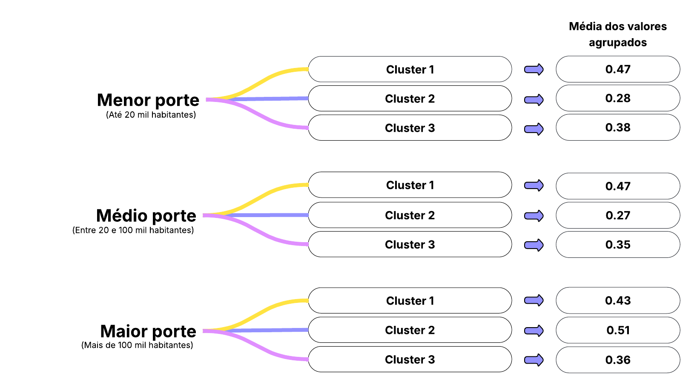
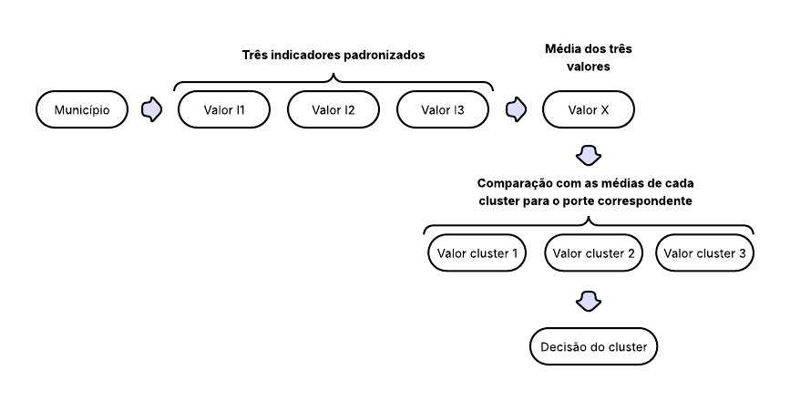
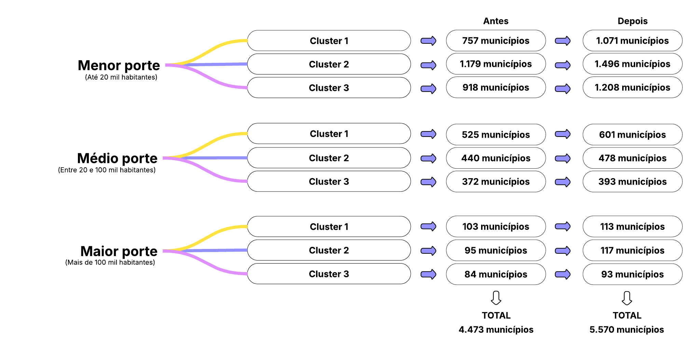
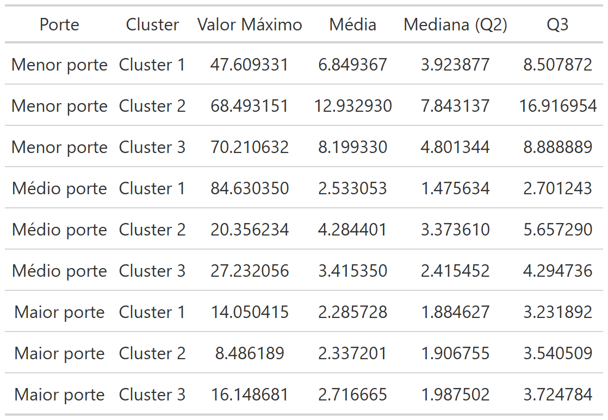
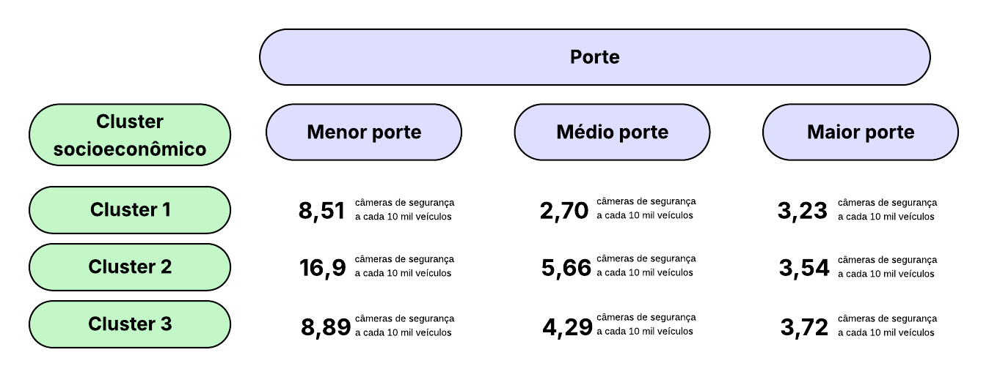

## Qual o nível de fiscalização eletrônica de velocidade que um município deve ter? 

Um estudo sobre o cenário da fiscalização eletrônica de velocidade nos municípios brasileiros. 

 

## Introdução e objetivo 
O excesso de velocidade é um dos principais fatores de risco para a ocorrência e a gravidade dos sinistros viários (WHO, 2023). Há um consenso internacionalmente sobre a necessidade de agir para uma gestão eficaz das velocidades, incluindo, entre outras estratégias, as medidas de fiscalização eletrônica de velocidade. Pensando nisso, o estudo “Indicadores Brasileiros de Velocidade” (ONSV; UFPR 2024) utilizou dados de 24.937 câmeras de segurança fixas para estabelecer indicadores de fiscalização eletrônica de velocidade para a definição do cenário atual sobre o tema no Brasil. Estes indicadores foram calculados para todos os municípios brasileiros que possuem câmeras de segurança fixas, o que resultou em um conjunto de dados com 1.789 municípios. Dentre 10 indicadores, foi utilizado o indicador do número de câmeras por 10 mil veículos como o indicador de fiscalização principal, manifestando o nível geral de fiscalização eletrônica de velocidade de um local.  

Baseado nisso, o presente estudo tem como objetivo estabelecer uma referência de qual seria o indicador de fiscalização eletrônica de velocidade mínimo para cada município brasileiro baseado no nível socioeconômico deste município, pois os indicadores socioeconômicos manifestam o potencial de mobilização dos municípios para o desenvolvimento de ações de segurança viária em seus territórios, incluindo a fiscalização eletrônica de velocidade.

## Metodologia 
A base de análise adotada foi a de indicadores de fiscalização eletrônica de velocidade do estudo “Indicadores Brasileiros de Velocidade” (ONSV; UFPR 2024), onde cada observação é um município e contém informações como: a quantidade total de câmeras de segurança em operação, a frota de veículos e o valor do indicador no nível de fiscalização eletrônica, o ano de referência adotado para a coleta de dados foi o de 2023.  

Na sequência, os municípios foram agregados segundo os clusters socioeconômicos estabelecidos no estudo “O Plano Nacional de Redução Mortes e Lesões no Trânsito: O Papel dos Municípios” (ONSV; UFPR 2021) por meio da aplicação da técnica de Análise de Componentes Principais (PCA). Os indicadores socioeconômicos utilizados no estudo foram: quantidade de veículos por mil habitantes (taxa de motorização), o Produto Interno Bruto (PIB) per capita e o Índice de Desenvolvimento Humano Municipal – IDHM (que considera os níveis de educação, saúde e renda dos municípios). Esses indicadores socioeconômicos representam o potencial de mobilização de cada município, pois quanto melhor o nível de desenvolvimento econômico e social, mais apto está um local para investir e engajar-se em ações de redução do risco e severidade dos sinistros de trânsito (ONSV; UFPR 2021). Este processo resultou em 3 clusters socioeconômicos por porte de município (menor, médio e maior), ou seja, resultando em 9 clusters no total.  

A base do estudo continha apenas 4.473 observações, excluídos municípios outliers (acima ou abaixo de três desvios padrões da média, ou seja, um z-score acima de 3 ou abaixo de -3) ou sem registros de mortes no trânsito. Para a alocação dos municípios excluídos da clusterização inicial, os três indicadores socioeconômicos de todos os municípios foram padronizados em uma escala de 0 a 1. Na sequência, foi calculada a média dos valores destes três indicadores padronizados de cada município, conforme Figura 1 a seguir:

{width=70%}

Figura 1: Processo de padronização dos indicadores para todos os municípios.

Depois disso, calculou-se a média do Valor X de todos os municípios de cada combinação de cluster, este processo não incluiu os valores dos municípios sem cluster definido. A Figura 2 demonstra os valores resultantes desses cálculos. 

{width=75%}

Figura 2: Média dos indicadores padronizados dos municípios existentes em cada combinação

A alocação final dos municípios restantes foi realizada por proximidade. Cada município faltante foi associado ao cluster cujo Valor X deste município apresentava a menor diferença absoluta em relação à média dos valores agrupados. Este procedimento garantiu que todos os municípios fossem associados ao grupo mais similar em termos de seus indicadores socioeconômicos agregados. A Figura 3 abaixo apresenta o processo completo. 

{width=75%}

Figura 3: Processo de alocação dos municípios sem cluster para um cluster já existente.

A Figura 4 representa o número de municípios em cada combinação de cluster e porte antes e depois do processo de alocação dos municípios faltantes. 

{width=85%}

Figura 4: Número de municípios antes e depois do processo de alocação.

Da base de clusters, selecionou-se apenas 4 variáveis: nome do município, UF, porte (menor, médio e maior) e cluster socioeconômico (1, 2 ou 3) para este estudo.  Para os municípios sem o registro de câmeras de segurança, considerou-se o valor “zero”. 

Para cada combinação de porte e cluster, foram calculadas estatísticas descritivas, como valor máximo, média, mediana (segundo quartil) e terceiro quartil do indicador de fiscalização eletrônica de velocidade, excluindo observações com zero câmeras de segurança para esses cálculos. A Tabela 1 representa os valores calculados para cada combinação.  

Tabela 1: Estatísticas descritivas do indicador de fiscalização eletrônica de velocidade.

{width=50%}

A fim de adotar como referência os melhores níveis de fiscalização eletrônica de velocidade em cada cluster, o valor correspondente ao terceiro quartil foi utilizado como nível de fiscalização eletrônica de velocidade mínimo, ou seja, o valor acima do qual apenas 25% dos municípios do cluster encontram-se. Consequentemente, a tabela final da referência do valor mínimo do nível de fiscalização eletrônica para todos os grupos resultou conforme o esquema da Figura 5:

{width=80%}

Figura 5: Valores de referência do nível de fiscalização eletrônica de velocidade para cada cluster.

## Resultados - Como utilizar o Dashboard
Ao abrir o painel de consulta, basta selecionar e Unidade Federativa e, em seguida, o município de interesse para verificar seu nível de fiscalização eletrônica de velocidade atual e mínimo, bem como outras informações. Exemplos de consultas realizadas no painel estão apresentados nas Figuras 6 e 7. 

{width=70%}

Figura 6: Exemplo de município acima do nível de fiscalização eletrônica de velocidade mínimo.

{width=70%}

Figura 7: Exemplo de município abaixo do nível de fiscalização eletrônica de velocidade.

Em uma análise conjunta dos 5.570 municípios brasileiros, tem-se um total de 23.406 equipamentos em operação. Para que todos os municípios que estão abaixo do nível de fiscalização eletrônica de velocidade mínimo atinjam o patamar ideal, seria necessária a instalação de mais 28.328 câmeras, totalizando 51.734 câmeras de segurança no país.  

## Referências
WHO (2023). Global Status Report on Road Safety 2023. Geneva: World Health Organization. 

ONSV; UFPR (2024). Indicadores Brasileiros Sobre Velocidade. Observatório Nacional de Segurança Viária e Universidade Federal do Paraná. 

UFPR; ONSV (2021). O Plano Nacional de Redução Mortes e Lesões no Trânsito: O Papel dos Municípios. Curitiba: Universidade Federal do Paraná. 

## Autoria
Painel elaborado por Ana Beatriz da Silva Marques (beatrizda@ufpr.br). Esse trabalho é um produto da cooperação técnica entre o Observatório Nacional de Segurança Viária e a Universidade Federal do Paraná.

Autores:

- [Ana Beatriz da Silva Marques](https://orcid.org/0009-0005-0639-8325)
- [Dr. Jorge Tiago Bastos](https://orcid.org/0000-0001-6447-1504)

Dúvidas, sugestões e comentários podem ser enviados para o e-mail onsv@onsv.org.br.