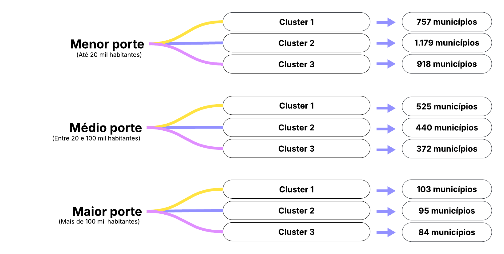
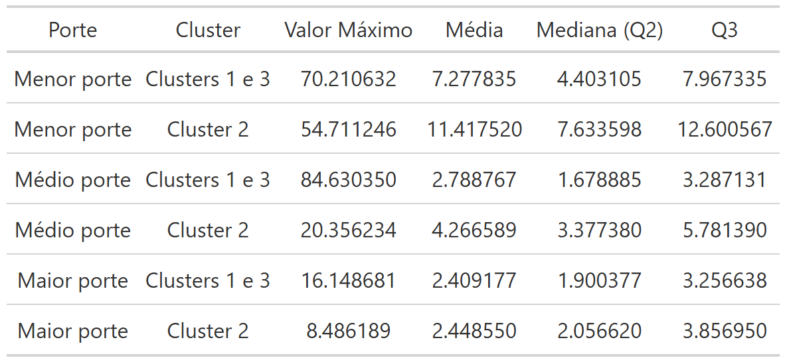
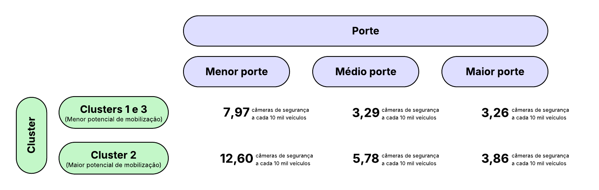
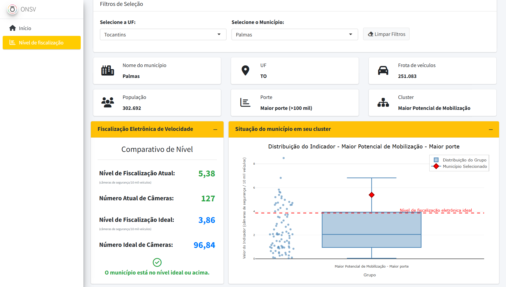
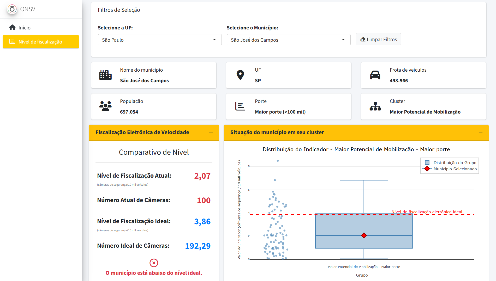

## Introdução e objetivo 
O excesso de velocidade é um dos principais fatores de risco para a ocorrência e a gravidade dos sinistros viários. Há um consenso internacionalmente sobre a necessidade de agir para uma gestão eficaz das velocidades, incluindo, entre outras estratégias, as medidas de fiscalização eletrônica de velocidade. Pensando nisso, o estudo “Indicadores Brasileiros de Velocidade” (ONSV; UFPR 2024) utilizou dados de 24.937 câmeras de segurança fixas para estabelecer indicadores de fiscalização eletrônica de velocidade para a definição do cenário atual sobre o tema no Brasil. Estes indicadores foram calculados para todos os municípios brasileiros que possuem câmeras de segurança fixas, o que resultou em um conjunto de dados com 1.789 municípios. Dentre 10 indicadores, foi utilizado o indicador do número de câmeras por 10 mil veículos como o indicador de fiscalização principal, manifestando o nível geral de fiscalização eletrônica de velocidade de um local.  

Baseado nisso, o presente estudo tem como objetivo estabelecer uma referência de qual seria o indicador de fiscalização eletrônica de velocidade ideal para cada município brasileiro baseado no nível socioeconômico deste município, pois os indicadores socioeconômicos manifestam o potencial de mobilização dos municípios para o desenvolvimento de ações de segurança viária em seus territórios, incluindo a fiscalização eletrônica de velocidade. 

## Metodologia 
A base de análise adotada foi a de indicadores de fiscalização eletrônica de velocidade do estudo “Indicadores Brasileiros de Velocidade” (ONSV; UFPR 2024), onde cada observação é um município e contém informações como: a quantidade total de câmeras de segurança em operação, a frota de veículos e o valor do indicador no nível de fiscalização eletrônica.  

Na sequência, os municípios foram agregados segundo os clusters socioeconômicos estabelecidos no estudo “O Plano Nacional de Redução Mortes e Lesões no Trânsito: O Papel dos Municípios” (ONSV; UFPR 2021) por meio da aplicação da técnica de Análise de Componentes Principais (PCA). Os indicadores socioeconômicos utilizados no estudo foram: quantidade de veículos por mil habitantes (taxa de motorização), o Produto Interno Bruto (PIB) per capita e o Índice de Desenvolvimento Humano Municipal – IDHM (que considera os níveis de educação, saúde e renda dos municípios). Esses indicadores socioeconômicos representam o potencial de mobilização de cada município, pois quanto melhor o nível de desenvolvimento econômico e social, mais apto está um local para investir e engajar-se em ações de redução do risco e severidade dos sinistros de trânsito (ONSV; UFPR 2021). Este processo resultou em 3 clusters socioeconômicos por porte de município (menor, médio e maior), ou seja, resultando em 9 clusters no total, conforme ilustrado no esquema da Figura 1 a seguir: 

{width=70%}

*Figura 1: Combinações de cada porte e cluster.*

Da base de clusters, selecionou-se apenas 4 variáveis: nome do município, UF, porte (menor, médio e maior) e cluster socioeconômico (1, 2 ou 3) para este estudo. Esta base contou com 4.473 observações, excluídos municípios outliers e sem registros de mortes no trânsito.  Para os municípios sem o registro de câmeras de segurança, considerou-se o valor “zero”. 

Para cada combinação de porte e cluster, foram calculadas estatísticas descritivas, como valor máximo, média, mediana (segundo quartil) e terceiro quartil do indicador de fiscalização eletrônica de velocidade, excluindo observações com zero câmeras de segurança para esses cálculos.  

Os municípios presentes no cluster 2 de cada porte apresentam os melhores indicadores socioeconômicos e, por isso, representam os locais com melhor potencial de mobilização. Já os clusters 1 e 3 tiveram valores muito semelhantes nas estatísticas descritivas e, por esse motivo, foi criado um novo agrupamento agregando as observações dos clusters 1 e 3, resultando então na Tabela 1 a seguir: 

*Tabela 1: Estatísticas descritivas do indicador de fiscalização eletrônica de velocidade.*
{width=60%}

A fim de adotar como referência os melhores níveis de fiscalização eletrônica de velocidade em cada cluster, o valor correspondente ao terceiro quartil foi utilizado como nível de fiscalização eletrônica de velocidade ideal, ou seja, o valor acima do qual apenas 25% dos municípios do cluster encontram-se. Consequentemente, a tabela final da referência do valor ideal do nível de fiscalização eletrônica para todos os grupos resultou conforme o esquema da Figura 2: 

{width=70%}

*Figura 2: Valores de referência do nível de fiscalização eletrônica de velocidade para cada cluster.*

## Resultados - Como utilizar o Dashboard
Ao abrir o painel de consulta, basta selecionar e Unidade Federativa e, em seguida, o município de interesse para verificar seu nível de fiscalização eletrônica de velocidade atual e ideal, bem como outras informações. Exemplos de consultas realizadas no painel estão apresentados nas Figuras 3 e 4. 

{width=70%}

*Figura 3: Exemplo de município acima do nível de fiscalização eletrônica de velocidade ideal.*

{width=70%}

*Figura 4: Exemplo de município abaixo do nível de fiscalização eletrônica de velocidade.*

Em uma análise conjunta dos 4.473 municípios disponíveis para consulta, tem-se um total de 20.898 equipamentos em operação. Para que todos os municípios que estão abaixo do nível de fiscalização eletrônica de velocidade ideal atinjam o patamar ideal, seria necessária a instalação de mais 24.440 câmeras, totalizando 45.338 câmeras de segurança no país.

## Referências
WHO (2023). Global Status Report on Road Safety 2023. Geneva: World Health Organization. 

ONSV; UFPR (2024). Indicadores Brasileiros Sobre Velocidade. Observatório Nacional de Segurança Viária e Universidade Federal do Paraná. 

UFPR; ONSV (2021). O Plano Nacional de Redução Mortes e Lesões no Trânsito: O Papel dos Municípios. Curitiba: Universidade Federal do Paraná. 

## Autoria
Painel elaborado por Ana Beatriz da Silva Marques (beatrizda@ufpr.br). Esse trabalho é um produto da cooperação técnica entre o Observatório Nacional de Segurança Viária e a Universidade Federal do Paraná.

Dúvidas, sugestões e comentários podem ser enviados para o e-mail onsv@onsv.org.br.